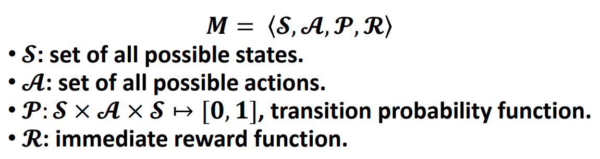
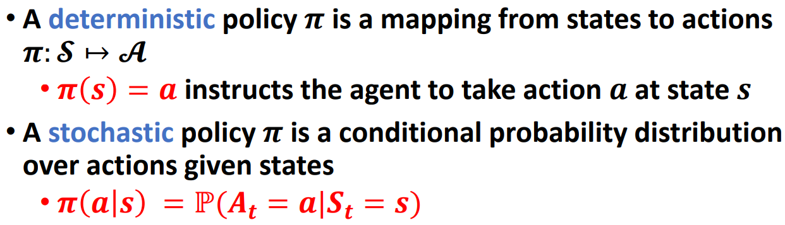
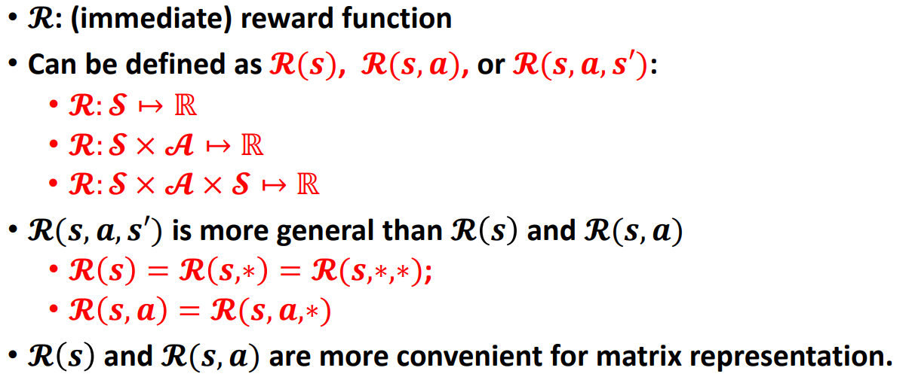
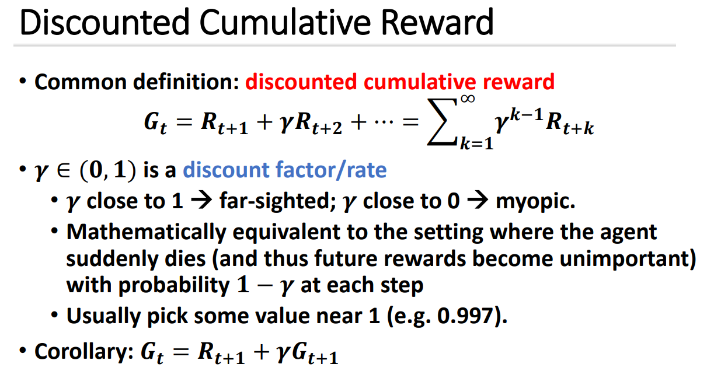
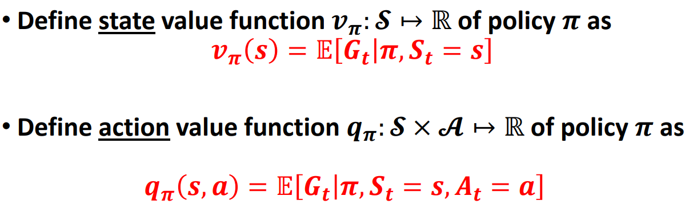
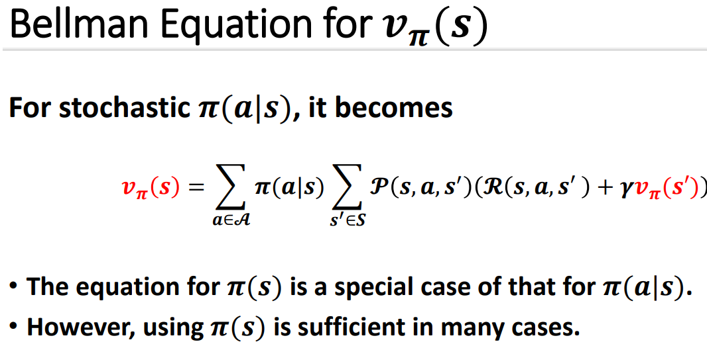
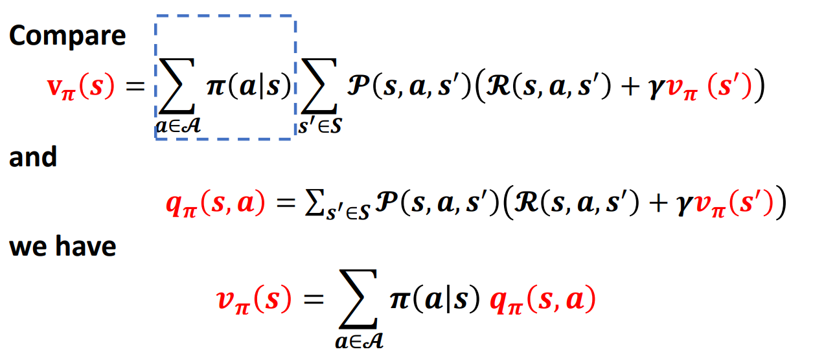

# 12MarkovDecisionProcess

A RL agent learns how to map situations (scenarios/states) to actions aiming at maximizing a numerical reward.

## Optimal Control: Incomplete History

**Bellman Equation:** uses the concepts of a dynamical system’s state and of a value function, or “optimal return function,” to define a functional equation (Hamilton and Jacobi -> Richard Bellman, mid-1950s).

**Dynamic Programming:** the class of methods for solving optimal control problems by solving the Bellman Equation [Bellman, 1957].

**Markov Decision Processes (MDPs):** the discrete stochastic version of the optimal control problem introduced by Bellman.

## Basic Concepts

The **environment stat**e contains the information used to determine what happens next given an action/a sequence of actions. 

The **agent state** is the agent’s representation of the observation or the environment, and contains the information used to determine what to act next.

### State and observation

An agent receives current state 𝑺𝒕 and reward 𝑹𝒕 from the environment, where 𝒕 denotes the time step/tick

 

## Markov Decision Process（MDPs）

**Markov property:** “given the present, the future is independent of the history”.

> The one-step dynamics is all you need to predict the next state and expected next reward.

In Markov decision process:
$$
\mathbb{P}(S_{t+1}|S_1,\cdots,S_t,A_1,\cdots,A_t) = \mathbb{P}(S_{t+1}|S_t,A_t)
$$

> given the present, the future is independent of the history

### Core Elements of RL

#### Policy

A policy defines an agent’s behaviour (mapping from state to action), i.e. how the agent acts in the given circumstance.

#### Reward

#### Value

#### Model

