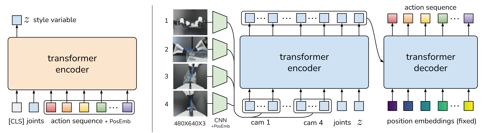
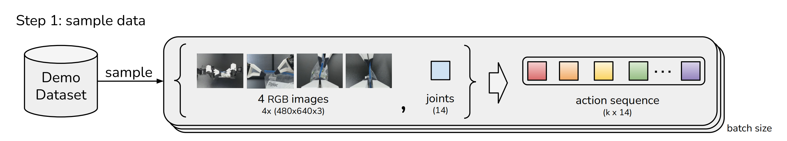
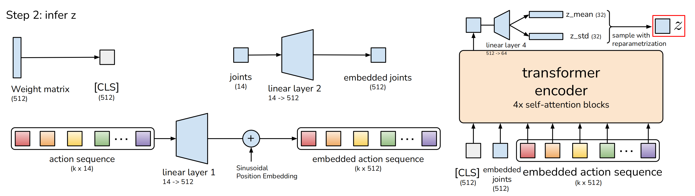
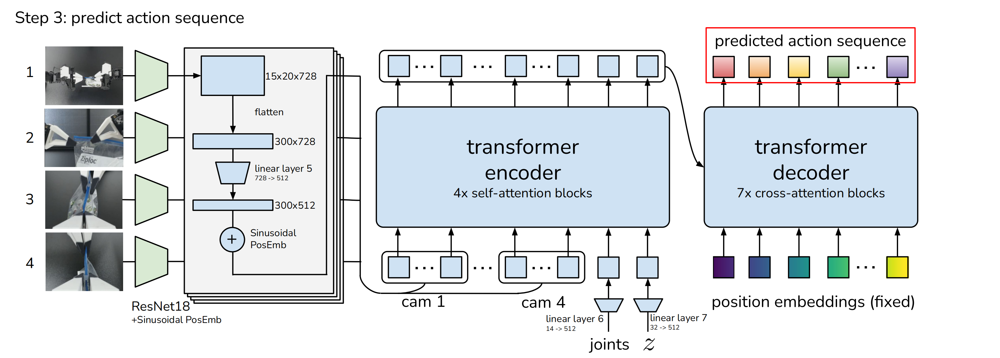

# Action Chunking with Transformers

基于Transformer在动作序列上生成模型并允许机器人学习现实世界中的困难任务

**key:** end-to-end imitation learning, Action Chunking, Temporal Ensemble

## 原理解析

### 整体流程

- **记录关节位置**：使用leader robots。之所以使用领导者的关节位置而不是跟随者的关节位置，是因为通过低级PID控制器施加力量时，这些力量是由“它们之间的差异”隐式定义决定的。
- 训练ACT根据当前观察结果预测未来动作序列（*train ACT to predict the sequence of future actions given the current observations*）
- 跟踪这些目标关节位置

#### 动作分块（Action Chunking）

这是一个神经科学概念，其中个体动作被分组在一起并作为一个单元执行，从而更有效地存储和执行(*We are inspired by action chunking, a neuro science concept where individual actions are grouped together and executed as one unit, making them more efficient to store and execute*)

1. Action Chunking(动作分块)

   如图片上半部分所示，每k步接收一个观察，并生成下一组k个动作，然后依次执行这些动作。

2. Temporal Ensemble(时间集成)

   时间集成通过加权平均对这些预测进行处理

   > 如上图所示
   > 在t=0时生成了t=0,1,2,<u>3</u>，四个动作步骤，比如  A B C <u>D</u>
   > 在t=1时生成了   t=1,2,<u>3</u>,4，四个动作步骤，比如   E F <u>G</u> H
   > 在t=2时生成了      t=2,<u>3</u>,4,5，四个动作步骤，比如    I  <u>J</u>  K L
   > 在t=3时生成了         t=<u>3</u>,4,5,6，四个动作步骤，比如    <u>M</u> N O P
   >
   > 在t=3时最终采用什么动作，由t=0,t=1,t=2,t=3这四段进行指数加权平均，来得到最终的结果

​	时间集成通过加权平均对这些预测进行处理，采用指数加权方案$w_i = exp(-m*i)$

###  Modeling human data 与 ACT的执行

#### CVAE

>  CVAE 是条件变分自编码器（Conditional Variational Auto - Encoder）的简称。它是变分自编码器（VAE）的一种扩展形式。它可以根据给定的条件生成数据。

左侧的CVAE编码器，预测样式变量$z$的分布的均值和方差，该分布被参数化为对角高斯分布。

- 输入：[CLS] token（后面会说到，时weight matrix），joints positions，action sequence + PosEnd

  >  “PosEmb” 是 “Position Embedding”（位置嵌入）的缩写。在自然语言处理和深度学习模型中，位置嵌入用于为序列中的每个元素（例如单词或关节位置）添加位置信息，以便**模型能够理解元素的顺序和相对位置**。这种技术在 Transformer 架构中被广泛使用，以帮助模型更好地处理顺序数据。

- 输出：使用[CLS]对应的特征**用于预测的$z$的均值和方差**

#### CVAE decoder

上图右侧的**CVAE解码器(即策略)**，通过$z$和当前观测(image+joints positions)的条件来预测动作序列(*即接下来的k个动作*)

> 他们使用ResNet图像编码器、transformer encoder，和transformer decoder来实现CVAE解码器

## 深入细节

### Sample data

- 输入：包括4张RGB图像，每张图像的分辨率为480 ×640，以及两个机器人手臂的关节位置(总共7+7=14 DoF)
- 输出：动作空间是两个机器人的绝对关节位置，一个14维向量。因此，通过动作分块，策略在给定当前观测的情况下输出一个**$k\times14$张量**

### Infer

**CVAE的细节**

输入：

- [CLS]token，它由随机初始化的学习权值组成

- **嵌入关节位置embedded joints**

  通过一个线性层linear layer2，把joints投影到嵌入维度的关节位置(*14维到512维*)，得到：embedded joints

- **嵌入动作序列embedded action sequence**

  通过另一个线性层linear layer1，把k × 14的action sequence投影到嵌入维度的动作序列(*k × 14维到k × 512维*)

输出：

- z style

### CVAE解码器预测动作序列

**第一步：图像处理**

1. 对于每一个图像观察，其皆被**ResNet18**处理以获得一个特征图(*将480×640×3 RGB图像转换为15×20×728的特征图，即which convert 480 × 640 × 3 RGB images into 15 × 20 × 512 feature maps*)
2. 然后flatten化以获得一个特征序列(*300×728*)
3. 特征用线性层linear layer5投影到嵌入维度(*300×512*)
4. 为了保留空间信息，再添加一个2D正弦位置嵌入(*即Sinusoidal PosEmb*)，相当于把位置信息添加到特征序列中
5. 对所有4张图像重复此操作，得到一个4 × 300 × 512，即1200 ×512维度的特征序列

**Transformer encoder**

输入：

- 图像
- joints
- z style

**CVAE decoder**

- transformer解码器的“query”是第一层固定的正弦位置嵌入，即如上图右下角所示的position embeddings(fixed)，其维度为k ×512
- transformer解码器的交叉注意力(cross-attention)层中的“keys”和“values”来自上述transformer编码器的输出

###  pseudocode

## ACT的优势（与其他ImitationLearning比较）

- BC-ConvMLP是最简单但最广泛使用的baseline，它采用卷积网络处理当前图像观测，并将其输出特征与关节位置连接，以预测动作
  BC-ConvMLP is the simplest yet most widely used baseline [69, 26], which processes the current image observations with a convolutional network, whose output features are concatenated with the joint positions to predict the action.

- BeT也利用Transformer作为架构，但有两个关键区别：

  1. 没有对动作进行分块处理，该模型在给定观测历史的情况下**预测一个动作**
     no action chunking: the model predicts one action given the history of observations
  2. 图像观测由单独训练的冻结视觉编码器预处理，即感知和控制网络没有联合优化
     the image observations are pre-processed by a separately trained frozen visual encoder. That is, the perception and control networks are not jointly optimized.

- RT-1是另一种基于Transformer的架构，从“固定长度的过去观测历史中”预测一个动作
  RT-1 [7] is another Transformerbased architecture that predicts one action from a fixed-length history of past observations.

  BeT和RT-1都离散化了动作空间：输出为离散箱分类分布，在BeT情况下还添加了连续偏移量。而ACT直接预测连续动作，这是出于精确操作所需精度驱使
  Both BeT and RT-1 discretize the action space: the output is a categorical distribution over discrete bins, but with an added continuous offset from the bincenter in the case of BeT. Our method, ACT, instead directly predicts continuous actions, motivated by the precision required in fine manipulation.

- VINN是一种非参数方法，在测试时假设可以访问演示数据。给定新的观察数据时，它检索具有最相似视觉特征的k个样本，并返回一个加权操作
  Lastly, VINN [42] is a non-parametric method that assumes access to the demonstrations at test time. Given a new observation, it retrieves the k observations with
  the most similar visual features, and returns an action using weighted k-nearest-neighbors.