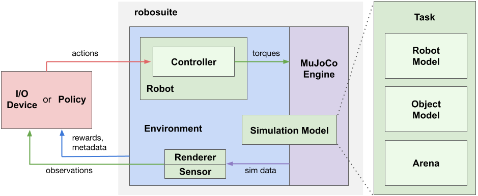

# ROBOSUITE学习笔记

## Moduls

### Overview

* **OSC_POSE:** Gripper moves sequentially and linearly in x, y, z direction, then sequentially rotates in x-axis, y-axis,
            z-axis, relative to the global coordinate frame
* **OSC_POSITION:** Gripper moves sequentially and linearly in x, y, z direction, relative to the global coordinate frame
* **IK_POSE:** Gripper moves sequentially and linearly in x, y, z direction, then sequentially rotates in x-axis, y-axis,
            z-axis, relative to the local robot end effector frame
* **JOINT_POSITION:** Robot Joints move sequentially in a controlled fashion
* **JOINT_VELOCITY:** Robot Joints move sequentially in a controlled fashion
* **JOINT_TORQUE:** Unlike other controllers, joint torque controller is expected to act rather lethargic, as the
            "controller" is really just a wrapper for direct torque control of the mujoco actuators. Therefore, a
            "neutral" value of 0 torque will not guarantee a stable robot when it has non-zero velocity!

#### Framework

- Modeling APIs: defining simulation environments in a modular and programmatic fashion.

- Simulation APIs:  interfacing with external inputs such as from a **Policy** or an **I/O Device**

  A **Simulation Model** specified by the Modeling APIs is instantiated by the **MuJoCo Engine** to create a simulation runtime, called **Environment**. The Environment generates observations through the **Sensors**, such as cameras and proprioception, and receives action commands from policies or devices through the **Controllers** of the **Robots**. 

- A simulation model is defined by a [Task](https://robosuite.ai/docs/modeling/task.html) object, which encapsulates three essential constituents of robotic simulation: [Robot Model](https://robosuite.ai/docs/modeling/robot_model.html)s, [Object Model](https://robosuite.ai/docs/modeling/object_model.html)s, and [Arena](https://robosuite.ai/docs/modeling/arena.html). 

### Robots

#### Runtime

Each robot then converts these actions into low-level torques via their respective controllers, and directly execute these torques in the simulation. These include specifications for a given robot, such as its DoF, action dimension, and torque limits, as well as proprioceptive values, such as its joint positions and velocities. Additionally, if the robot is enabled with any sensors, those readings can also be polled as well.

> robot是将action最终转换为torque对robot进行控制

#### Callables

At any given time, each robot has a set of `properties` whose real-time values can be accessed at any time.

A full list of robot properties can be found in the [Robots API](https://robosuite.ai/docs/simulation/robot.html) section.

> robot的各个传感器、关节状态值都可以实时访问

#### Models

we provide a [rudimentary guide](https://docs.google.com/document/d/1bSUKkpjmbKqWyV5Oc7_4VL4FGKAQZx8aWm_nvlmTVmE/edit?usp=sharing) on how to import raw Robot and Gripper models (based on a URDF source file) into robosuite.

#### Objects

### Environments

#### Interacting with Environment

policy design

#### Task

Each `Task` class instance owns an `Arena` model, a list of `RobotModel` instances, and a list of `ObjectModel` instances. These are **robosuite** classes that introduce a useful abstraction in order to make designing scenes in MuJoCo easy. Every `Arena` is based off of an xml that defines the workspace (for example, table or bins) and camera locations. Every `RobotModel` is a MuJoCo model of representing an arbitrary robot (for `ManipulationModel`s, this represent armed robots, e.g. Sawyer, Panda, etc.). Every `ObjectModel` corresponds to a physical object loaded into the simulation (e.g. cube, pot with handles, etc.).

## 源代码阅读

### environment

`lift.py`

