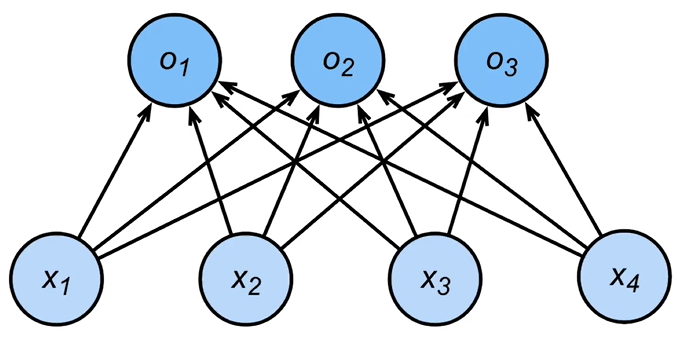

# 深度学习

## 预备知识

### 线性回归+基础优化算法

#### 线性模型

- 给定n维输入$x = [x_1,x_2,\dots,x_n]^T$

- 线性模型有一个n维权重和一个标量偏差
  $$
  w = [w_1,w_2,\dots,w_n]^T,b
  $$

- 输出是输入的加权平方和
  $$
  y=w_1x_1+w_2x_2+\dots+w_nx_n+b
  $$

- 向量版本：$y=\langle w,x\rangle+b$

#### 衡量预估质量

- 比较真实值和预估值
  $$
  \ell(y,\hat y) = \frac{1}{2}(y- \hat y)^2
  $$

  > y：真实值
  >
  > $\hat y$：估计值
  >
  > $\frac{1}{2}$：微分时候可约
  >
  > 这个叫做平方损失(MSE)

#### 训练数据

- 通常越多越好

- 假设我们有n个样本，记
  $$
  X = [x_1,x_2,\dots,x_n]^T \quad y = [y_1,y_2,\dots,y_n]^T  
  $$

- 训练损失
  $$
  \ell(X,y,w,b)=\frac{1}{2n}\sum_{i=1}^n(y_i-\langle x_i,w\rangle-b)^2=\frac{1}{2n}||y-Xw-b||^2
  $$

- 最小化损失来学习参数
  $$
  \mathbf{w}^*, b^* = \arg \min_{w, b} \, \ell(\mathbf{X}, \mathbf{y}, \mathbf{w}, b)
  $$
  

**显示解**

> 数据结构简单，可以显式的带入公式求解

- 将偏差加入权重
  $$
  X \leftarrow [X, 1] \quad w \leftarrow \begin{bmatrix} \mathbf{w} \\ b \end{bmatrix} 
  $$
  
  
- 损失函数  
  $$
  \ell(X, \mathbf{y}, \mathbf{w}) = \frac{1}{2n} \left\| \mathbf{y} - X \mathbf{w} \right\|^2
  $$

- 梯度计算
  $$
  \frac{\partial}{\partial \mathbf{w}} \ell(X, \mathbf{y}, \mathbf{w}) = \frac{1}{n} ( \mathbf{y} - X \mathbf{w} )^T X
  $$

- 损失是凸函数，所以最优解满足  
  $$
  \frac{\partial}{\partial \mathbf{w}} \ell(X, \mathbf{y}, \mathbf{w}) = 0
  \Rightarrow \frac{1}{n} ( \mathbf{y} - X \mathbf{w} )^T X = 0
  \Rightarrow \mathbf{w}^* = (X^T X)^{-1} X \mathbf{y}
  $$
  
  > 最后的$(X^T X)^{-1} X \mathbf{y}$就是显示解
  >
  > 矩阵求导法则$\frac{dA^2}{dx}=2A^T$
  >
  > 最后一个等式我推导出来是$(X^T X)^{-1} X^T \mathbf{y}$- 

损失为什么要平均？

> 不管批量大小，损失和学习率都是对应的

#### 总结

- 线性回归是对n维输入的加权，外加偏差
- 使用MSE来衡量预测值和真实值的差异
- 线性回归有显示解
- 线性回归可以看作是单层神经网络

### 基础优化算法（梯度下降）

- 挑选一个初始值$w_0$

- 重复迭代参数$t=1,2,3$
  $$
  w_t = w_{t-1}-\eta\frac{\delta\ell}{\delta w_{t-1}}
  $$

  - 沿学习率方向增加啊损失函数值
  - 学习率(learning rate)：步长的超参数(Hyperparameters)

- 学习率的选择：

  - 不能太小，太小迭代时间长，收敛速度慢，还容易陷入局部最优

  - 不能太大，太大会造成梯度爆炸（gradient explosion）

#### 小批量随机梯度下降

- 在整个训练集上计算梯度太贵

  > 一个深度神经网络模型可能需要数分钟至数小时，too many many hyerparameters

- 可以随机采样b个样本$i_1,i_2,\dots,i_b$来近似损失
  $$
  \frac{1}{b}\sum_{i\in I_b}\ell(x_i,y_i,w)
  $$

  > b是批量（batch）大小，另一个重要的超参数

- 同样的batch的选取也不能过大或者过小

#### 总结

- 梯度下降通过不断沿着繁体都方向更新参数求解
- 小批量随机梯度下降是深度学习默认的求解算法
- 两个重要的超参数：学习率和batch大小

### Softmax回归

分类：通常多个输出，输出$i$是预测为第$i$类的置信度

- 对类别进行**一位**有效编码
  $$
  \mathbf{y} = [y_1,y_2,\dots,y_n]^T \quad y_i = \begin{cases} 
        1 & \text{if } i = y \\ 
        0 & \text{otherwise} 
     \end{cases}
  $$

- 使用均方损失训练

- 最大值作为预测
  $$
  \hat{y} = \arg \max_{i}o_i
  $$

- 需要更置信的识别正确类（大余量）
  $$
  o_y - o_i \geq \Delta(y,i)
  $$

  > 对于分类y，置信度$o_y$明显大于其他$o_i$的置信度

- 输出匹配概率（非负，和为1）
  $$
  \hat{y} = softmax(o) \\
  \hat{y_i} = \frac{exp(o_i)}{\sum_k exp(o_i)}
  $$

- 概率$y$和$\hat{y}$的区别作为损失